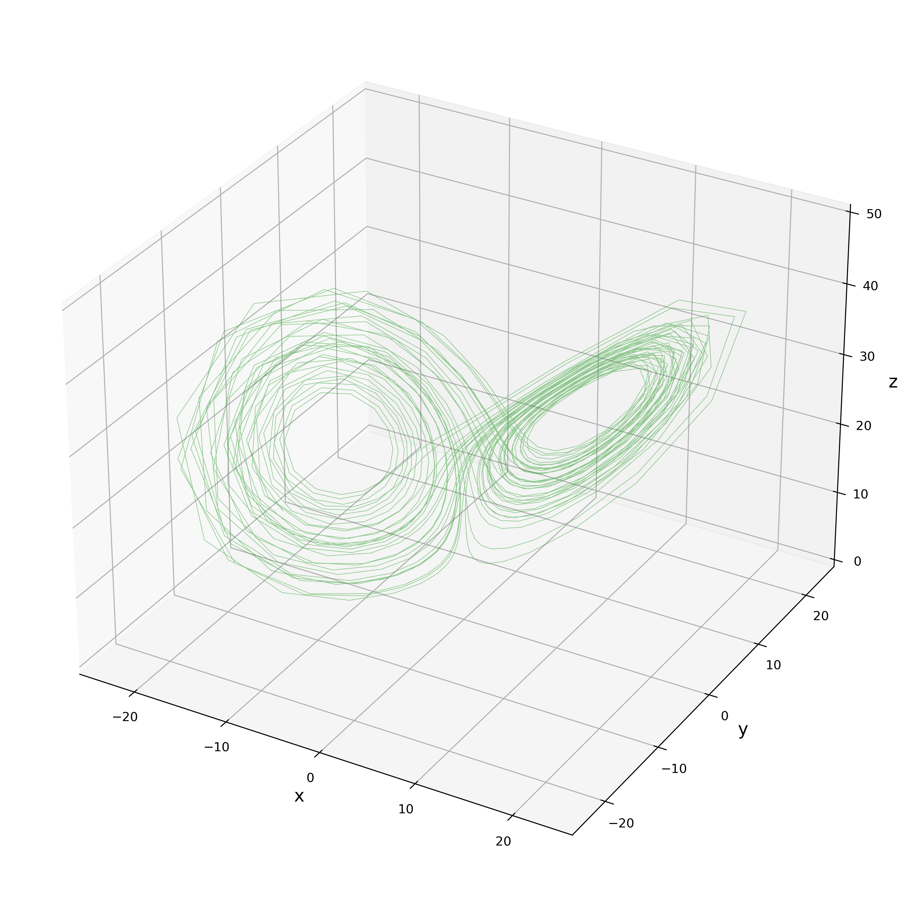

# **01月09日 進捗報告**

## Kalman Filter によるパラメータ推定（修正）

### Lorenz-63 モデルの $\sigma$

 

#### 0500-32-7354,　佐藤 匠

---

<!-- _class: chap_head-->

# 前回 (12/19) のふりかえり

---

# [ふり返り] 問題設定｜Lorenz-63

**「Kalman Filter によるパラメータ推定」** のデモンストレーション
Lorenz-63 モデルを 4次の Runge-Kutta 法 ($\Delta t = 0.05$) で積分するモデル $\mathcal{M}$

$
\frac{ \mathrm{d} \vec{x} }{\mathrm{d} t} = 
\left\lbrace
\begin{aligned}
& \frac{\mathrm{d} x}{\mathrm{d} t}=\sigma(y-x), \\[5pt]
& \frac{\mathrm{d} y}{\mathrm{d} t}=x(\rho-z)-y \\[5pt]
& \frac{\mathrm{d} z}{\mathrm{d} t}=x y - \beta z .
\end{aligned}
\right.
$

パラメータは $\sigma, \ \rho, \ \beta$ の3つ。
推定するパラメータを状態変数ベクトルに入れ込んで EKF を回す。
例： $\vec{x} = (x, y, z, \sigma)^T$

---

# [ふり返り] 問題設定｜同化する観測データ $y^O_{t}$ 

正解のパラメータは時間変化なしで
$\sigma = 10, \quad \rho = 28, \quad \beta = 8/3$

空間座標 $x, y, z$ は、spin up 後の
1000データをアトラクタ上の真値として入手。
分散 1 のノイズを載せる。

---

# [ふり返り] 問題設定｜パラメータ推定なし $(x, y, z)$

<table>
<td></td>
<td>

テストとして、パラメータ推定なしで同化を実行。

初期値はとりあえず、
最初の観測値を鵜呑みにする。

$x^a_{~0} = y^O_{~0}, \quad P^a_{~0} = H = I$

**Filter Divergence** - 
　同期と非同期の 
　on-off intermittency が発生。(Covariance Inflation 無しのため)
 
</td>
</table>

---

# [ふり返り] パラメータ推定実験｜$(x, y, z, \sigma)$ の $x$

<table>
<td></td>
<td>

3つあるパラメータ $\sigma, \ \rho, \ \beta$ のうち
$\sigma$ のみを推定。正解は $\sigma = 10$

$\sigma$ の初期値は適当に 8 とする。

*疑問: 
$P^a$ の初期値をどうするか？*

 

**Covariance Inflation 無しでも
長期間にわたって同化できたが...**
 
</td>
</table>

---

# [ふり返り] パラメータ推定実験｜$(x, y, z, \sigma)$ の $\sigma$

<table>
<td></td>
<td>

3つあるパラメータ $\sigma, \ \rho, \ \beta$ のうち
$\sigma$ のみを推定。正解は $\sigma = 10$

$\sigma$ の初期値は適当に 8 とする。

 

**正解よりも少し小さい値を解答。**
**→ 同化失敗 (パラメータ空間でFD)**

 
</td>
</table>

---

# パラメータ推定実験｜$(x, y, z, \sigma)$ の $\sigma$

<table>
<td></td>
<td>

3つあるパラメータ $\sigma, \ \rho, \ \beta$ のうち
$\sigma$ のみを推定。正解は $\sigma = 10$

$\sigma$ の初期値は適当に 8 とする。

 

パラメータ空間の RMSE と $P^a$ を調べる。

 

**正解よりも少し小さい値を解答。**
**→ 同化失敗 (パラメータ空間でFD)**

 
</td>
</table>

---

<!-- _class: chap_head-->

# Additive Inflation を入れてみる。

---

# Inf付パラメータ推定実験｜実験の設定

状態変数空間とパラメータ空間でインフレーションを変えやすいAdditive Inflation を採用。

$$P^a_\mathrm{inf} = P^a_\mathrm{orig} + P^\mathrm{add}$$

$$
P^\mathrm{add} = 
\begin{pmatrix}
\alpha_{xyz} & 0 & 0 & 0 \cr
0 & \alpha_{xyz} & 0 & 0 \cr
0 & 0 & \alpha_{xyz} & 0 \cr
0 & 0 & 0 & \alpha_{\sigma} \cr
\end{pmatrix}
$$

 

調整パラメータは $\alpha_{xyz}, \alpha_\sigma$ の二つ。

---

# Inf付パラメータ推定実験｜$(x, y, z, \sigma)$ の $x$

<table>
<td></td>
<td>

正解は $\sigma = 10$
$\sigma$ の初期値は適当に 8 とする。

 

$\alpha_{xyz} = 0.0$
$\alpha_{\sigma} = 0.01$

 

**状態変数は最後まで同化できた。**

 
</td>
</table>

---

# Inf付パラメータ推定実験｜$(x, y, z, \sigma)$ の $\sigma$

<table>
<td></td>
<td>

正解は $\sigma = 10$
$\sigma$ の初期値は適当に 8 とする。

 

$\alpha_{xyz} = 0.0$
$\alpha_{\sigma} = 0.01$

 

**正解の周りを上下に振動
→ うまく推定できている。**

 
</td>
</table>

---

# Inf付パラメータ推定実験｜$(x, y, z, \sigma)$ の $\sigma$

<table>
<td></td>
<td>

正解は $\sigma = 10$
$\sigma$ の初期値は適当に 8 とする。

 

$\alpha_{xyz} = 0.0$
$\alpha_{\sigma} = 0.01$

 

**正解の周りを上下に振動
→ うまく推定できている。**

 
</td>
</table>

---

# Inf付パラメータ推定実験｜$(x, y, z, \sigma)$ の $\alpha_{xyz}, \alpha_\sigma$

<table>
<td></td>
<td></td>
</table>

---
