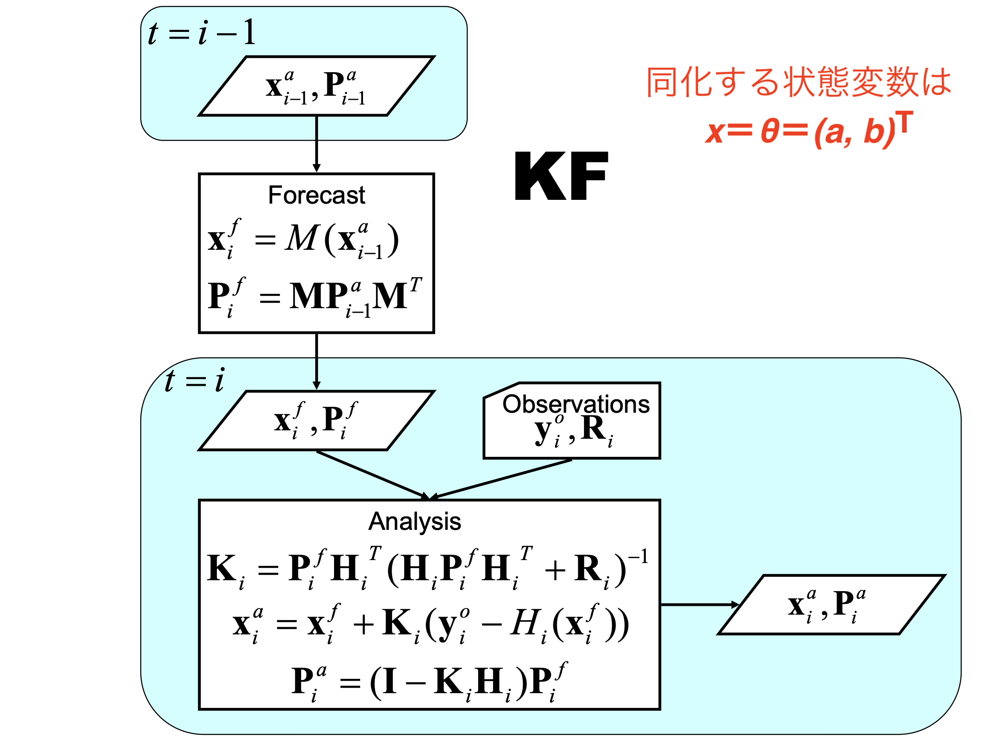

# **01月16日 進捗報告**

## Kalman Filter によるパラメータ推定

### 機械学習に特有のパラメータ推定法？

 

#### 0500-32-7354,　佐藤 匠

---

<!-- _class: chap_head-->

# 前回 (1/9) のふりかえり

---

# [ふり返り] 問題設定｜Lorenz-63

**「Kalman Filter によるパラメータ推定」** のデモンストレーション
Lorenz-63 モデルを 4次の Runge-Kutta 法 ($\Delta t = 0.05$) で積分するモデル $\mathcal{M}$

$
\frac{ \mathrm{d} \vec{x} }{\mathrm{d} t} = 
\left\lbrace
\begin{aligned}
& \frac{\mathrm{d} x}{\mathrm{d} t}=\sigma(y-x), \\[5pt]
& \frac{\mathrm{d} y}{\mathrm{d} t}=x(\rho-z)-y \\[5pt]
& \frac{\mathrm{d} z}{\mathrm{d} t}=x y - \beta z .
\end{aligned}
\right.
$

パラメータは $\sigma, \ \rho, \ \beta$ の3つ。
推定するパラメータを状態変数ベクトルに入れ込んで EKF を回す。
例： $\vec{x} = (x, y, z, \sigma)^T$

---

# [ふり返り] Inf付パラメータ推定実験｜実験の設定

状態変数空間とパラメータ空間でインフレーションを変えやすいAdditive Inflation を採用。

$$P^a_\mathrm{inf} = P^a_\mathrm{orig} + P^\mathrm{add}$$

$$
P^\mathrm{add} = 
\begin{pmatrix}
\alpha_{xyz} & 0 & 0 & 0 \cr
0 & \alpha_{xyz} & 0 & 0 \cr
0 & 0 & \alpha_{xyz} & 0 \cr
0 & 0 & 0 & \alpha_{\sigma} \cr
\end{pmatrix}
$$

 

調整パラメータは $\alpha_{xyz}, \alpha_\sigma$ の二つ。

---

# [ふり返り] Inf付パラメータ推定実験｜$(x, y, z, \sigma)$ 

<table>
<td></td>
<td>

正解は $\sigma = 10$
$\sigma$ の初期値は適当に 8 とする。

 

$\alpha_{xyz} = 0.0$
$\alpha_{\sigma} = 0.01$

 

**正解の周りを上下に振動
→ うまく推定できている。**

 
</td>
</table>

---

<!-- _class: chap_head-->

# RNN に向けて

## $dx = f(x, t) dt$ ではなく $x_i = f(x_{i-1})$

---

# AR や RNN は 漸化式のようなモデル

**AR(2) モデル**

$Z_t = \varepsilon_t + c + \phi_1 \ Y_{t-1} + \phi_2 \ Y_{t-2}$

$Z_t = f( Y_{t-1}, Y_{t-2})$

（$c,\ \phi_i$ がパラメータ）

 

直前の値を入れると、
次ステップの値が返ってくる。

 

RNN →

---

# 機械学習 "的な" パラメータ推定

Kalman Neuro Computing における
機械学習 (パラメータ推定) は、講義
で習った推定法**ではない！**

 

##### これまで試していた推定法

推定するパラメータを状態変数ベクトルに
入れ込んで EKF を回す。
例： $\vec{x} = (x, y, z, \sigma)^T$

 

##### Kalman Neuro Computing での推定法

機械学習モデルは時間発展モデル $x_{i+1} = \mathcal{M}(x_i), \ (x_i = y_i, \ H=I)$ ではなく、
観測演算子 $y^b_{i} = \mathcal{H} (x^f_i) = z^{out} (y_{i-1} | \theta = \hat{\theta}_{i-1})$ で $M=I$

---

# 機械学習 "的な" パラメータ推定

Kalman Neuro Computing における
機械学習 (パラメータ推定) は、講義
で習った推定法**ではない！**

 

##### これまで試していた推定法

推定するパラメータを状態変数ベクトルに
入れ込んで EKF を回す。
例： $\vec{x} = (x, y, z, \sigma)^T$

 

##### Kalman Neuro Computing での推定法

機械学習モデルは時間発展モデル $x_{i+1} = \mathcal{M}(x_i), \ (x_i = y_i, \ H=I)$ ではなく、
観測演算子 $y^b_{i} = \mathcal{H} (x^f_i) = z^{out} (y_{i-1} | \theta = \hat{\theta}_{i-1})$ で $M=I$

---

# 機械学習 "的な" パラメータ推定

Kalman Neuro Computing における
機械学習 (パラメータ推定) は、講義
で習った推定法**ではない！**

 

##### これまで試していた推定法

推定するパラメータを状態変数ベクトルに
入れ込んで EKF を回す。
例： $\vec{x} = (x, y, z, \sigma)^T$

 

##### Kalman Neuro Computing での推定法

機械学習モデルは時間発展モデル $x_{i+1} = \mathcal{M}(x_i), \ (x_i = y_i, \ H=I)$ ではなく、
観測演算子 $y^b_{i} = \mathcal{H} (x^f_i) = z^{out} (y_{i-1} | \theta = \hat{\theta}_{i-1})$ で $M=I$

---

# TLM を H として使う

$$
\begin{pmatrix}
\delta x_i \\[10pt] \delta y_i \\[10pt] \delta a \\[10pt] \delta b
\end{pmatrix}

=

\begin{pmatrix}
\frac{\partial x_i}{\partial x_{i-1}} & \frac{\partial x_i}{\partial y_{i-1}} & \frac{\partial x_i}{\partial a} & \frac{\partial x_i}{\partial b} \\[10pt]
\frac{\partial y_i}{\partial x_{i-1}} & \frac{\partial y_i}{\partial y_{i-1}} & \frac{\partial y_i}{\partial a} & \frac{\partial y_i}{\partial b} \\[10pt]
0 & 0 & 1 & 0 \\[10pt]
0 & 0 & 0 & 1 \\[10pt]
\end{pmatrix}

\begin{pmatrix}
\delta x_{i-1} \\[10pt] \delta y_{i-1} \\[10pt] \delta a \\[10pt] \delta b
\end{pmatrix}
$$

Simultaneous estimation で使う Henon 写像の TLM のうち、右上の 2x2 が

$$H = \frac{\partial z^{out}}{\partial \theta}$$

---

<!-- _class: chap_head-->

# RNN に向けて

## 機械学習"的な"パラメータ推定を試す

---

# KNC っぽい推定｜Henon 写像

<table>

<td> </td>

<td>
離散的なモデル。

$
\left\lbrace\begin{array}{l}
x_{i+1} = 1- ax_{i}^2 + y_{i} \cr
y_{i+1} = bx_{i}
\end{array}\right.
$

パラメータは $a, \ b$

正解の値は
$a = 1.4, \quad b = 0.3$
とする。

</td>

<td>

初期値 $\vec{Y}_0 = (1.1, \ 0.2)^T$ として 60 時点のデータを作成し、

- 訓練:   前 40 点学習
- 検証:   後 20 点予測

観測誤差は半径 0.1 の正規分布
</td>

</table>

---

# KNC っぽい推定｜慣れ親しんだ推定法 (inf無, 軌道)

<table>

<td> </td>

<td>
　　
</td>

<td>

状態変数ベクトルを$\vec{x} = (x, y, a, b)^T$
として同化（Inflation なし）。

つまり、Henon写像を
時間発展モデル $x_{i+1} = \mathcal{M}(x_i)$ 
として EKF に入力している。

初期値は $(a, b) = (2.0, 0.0)$, 
$(x, y)$ は最初の観測を鵜呑み、
$P^a$ は $P^a_{xy} = 0.1, \ P^a_{ab}=0.5$

**パラメータ空間でフィルター発散。**

 
</td>

</table>

---

# KNC っぽい推定｜慣れ親しんだ推定法 (inf無, 誤差)

<table>

<td> </td>

<td>
　　
</td>

<td>

状態変数ベクトルを

$\vec{x} = (x, y, a, b)^T$

として同化（Inflation なし）。

x, y の予測だけを見ると
うまくいっている。

予測期間で $P^f_i = M P^f_{i-1} M^T$ 
とすると **$P^a$ の値は爆発する。**
**（Q. 予報のRMSEから外れすぎ？）**
</td>

</table>

---

# KNC っぽい推定｜慣れ親しんだ推定法 (inf有, 軌道)

<table>

<td> </td>

<td>
　　
</td>

<td>

状態変数ベクトルを

$\vec{x} = (x, y, a, b)^T$

として同化（Inflation あり）。

Additive Inflation は $P^a$ の
x, y に それぞれ +0.001
a に +0.05
b に +0.03

動いたが $a$ の $P^a$ が大きい。
</td>

</table>

---

# KNC っぽい推定｜慣れ親しんだ推定法 (inf有, 誤差)

<table>

<td> </td>

<td>
　　
</td>

<td>

状態変数ベクトルを

$\vec{x} = (x, y, a, b)^T$

として同化（Inflation あり）。

**x, y の予報の RMSE が悪化した。**

</td>

</table>

---

# KNC っぽい推定｜新しい推定法 (infなし)

<table>

<td> </td>

<td>

状態変数ベクトルを $\vec{x} = (a, b)^T$
として同化（Inflation なし）。

つまり、Henon写像を
観測演算子 $z_{i+1} = \mathcal{H}(y_i | a, b)$ 
として EKF に入力している。

Inflation 無しでも動く時と、動かない時がある。
</td>

</table>

---

# KNC っぽい推定｜新しい推定法 (infあり)

<table>

<td> </td>

<td>

状態変数ベクトルを $\vec{x} = (a, b)^T$
として同化（Inflation なし）。

Additive Inflation は $P^a$ の
a, b にそれぞれ +0.01

少ない Inflation で理想的な動き。

**Q. 
x, yは同化していないので、
予測誤差の予測 $P^f_{xy}$ は計算不可？**
</td>

</table>