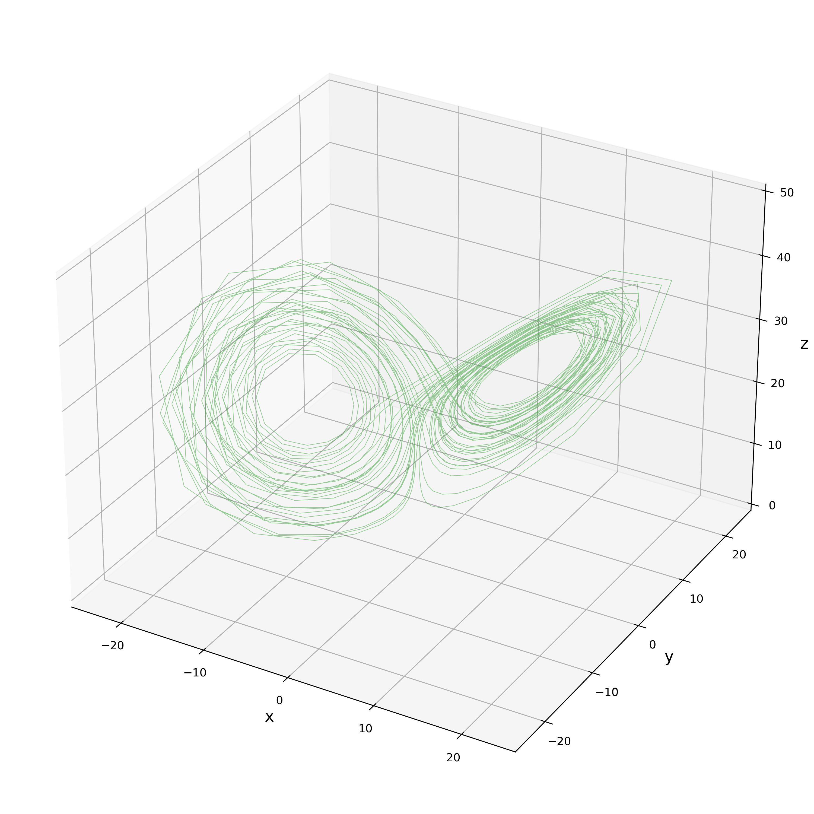

# **12月19日 進捗報告**

## Kalman Filter によるパラメータ推定

### Lorenz-63 モデルの $\sigma, \rho, \beta$

 

#### 0500-32-7354,　佐藤 匠

---

# 中間発表より｜[課題4] 実習課題の概要

### テーマ: パラメータ推定

##### &emsp;時系列予測に用いられる機械学習モデル (AR, RNN) と   &emsp;データ同化の融合

 

#### 研究の背景

よくある「学習」＝ **RMSE** の逆伝搬
&emsp; → 『どの程度外れそうか』の予報 (UQ) が難しい 
&emsp; → **尤度に基づいた学習の実装**

#### 今後の計画

- ✅ 先行研究・具体的な実装法のサーベイ (12/12 まで)
- 🔥 AR(p) の実装（12月中）
- 🔲 RNN の実装（1月中）

---

# 問題設定｜Lorenz-63

**「Kalman Filter によるパラメータ推定」** のデモンストレーション
Lorenz-63 モデルを 4次の Runge-Kutta 法 ($\Delta t = 0.05$) で積分するモデル $\mathcal{M}$

$
\frac{ \mathrm{d} \vec{x} }{\mathrm{d} t} = 
\left\lbrace
\begin{aligned}
& \frac{\mathrm{d} x}{\mathrm{d} t}=\sigma(y-x), \\[5pt]
& \frac{\mathrm{d} y}{\mathrm{d} t}=x(\rho-z)-y \\[5pt]
& \frac{\mathrm{d} z}{\mathrm{d} t}=x y - \beta z .
\end{aligned}
\right.
$

パラメータは $\sigma, \ \rho, \ \beta$ の3つ。
推定するパラメータを状態変数ベクトルに入れ込んで EKF を回す。
例： $\vec{x} = (x, y, z, \sigma)^T$

---

# 問題設定｜同化する観測データ $y^O_{t}$ の作成

正解のパラメータは時間変化なしで
$\sigma = 10, \quad \rho = 28, \quad \beta = 8/3$

空間座標 $x, y, z$ は、spin up 後の
1000データをアトラクタ上の真値として入手。
分散 1 のノイズを載せる。

---

# 問題設定｜パラメータ推定なしの同化 $(x, y, z)$

<table>
<td></td>
<td>

テストとして、パラメータ推定なしで同化を実行。

初期値はとりあえず、
最初の観測値を鵜呑みにする。

$x^a_{~0} = y^O_{~0}, \quad P^a_{~0} = H = I$

**Filter Divergence** - 
　同期と非同期の 
　on-off intermittency が発生。(Covariance Inflation 無しのため)
 
</td>
</table>

---

# パラメータ推定実験｜$\sigma$ のみ $(x, y, z, \sigma)$ の $x$

<table>
<td></td>
<td>

3つあるパラメータ $\sigma, \ \rho, \ \beta$ のうち
$\sigma$ のみを推定。正解は $\sigma = 10$

$\sigma$ の初期値は適当に 8 とする。

*疑問: 
$P^a$ の初期値をどうするか？*

 

**Covariance Inflation 無しでも
長期間にわたって同化できた。**
 
</td>
</table>

---

# パラメータ推定実験｜$\sigma$ のみ $(x, y, z, \sigma)$ の $x$

<table>
<td></td>
<td>

3つあるパラメータ $\sigma, \ \rho, \ \beta$ のうち
$\sigma$ のみを推定。正解は $\sigma = 10$

$\sigma$ の初期値は適当に 8 とする。

 

**正解よりも少し小さい値を解答。**
 
</td>
</table>

---

# パラメータ推定実験｜全部 $(x, y, z, \sigma, \rho, \beta)$ の $x$

<table>
<td></td>
<td>

正解は $\sigma = 10, \ \rho = 28, \ \beta = 8/3$

初期値はそれぞれ
- $\sigma$ : 12　　(大きめ)
- $\rho$   : 20　　(小さめ)
- $\beta$  : 8/3　(最初から正解)

 

**Covariance Inflation 無しでも
最後までうまく同化できた。**
 
</td>
</table>

---

# パラメータ推定実験｜全部 $(x, y, z, \sigma, \rho, \beta)$ の $\sigma$

<table>
<td></td>
<td>

正解は $\sigma = 10, \ \rho = 28, \ \beta = 8/3$

初期値はそれぞれ
- $\sigma$ : 12　　(大きめ)
- $\rho$   : 20　　(小さめ)
- $\beta$  : 8/3　(最初から正解)

 

**やはり $\sigma$ は小さめの値を解答。**
 
</td>
</table>

---

# パラメータ推定実験｜全部 $(x, y, z, \sigma, \rho, \beta)$ の $\rho$

<table>
<td></td>
<td>

正解は $\sigma = 10, \ \rho = 28, \ \beta = 8/3$

初期値はそれぞれ
- $\sigma$ : 12　　(大きめ)
- $\rho$   : 20　　(小さめ)
- $\beta$  : 8/3　(最初から正解)

 

**逆に $\rho$ は大きめの値を解答。**
 
</td>
</table>

---

# パラメータ推定実験｜全部 $(x, y, z, \sigma, \rho, \beta)$ の $\beta$

<table>
<td></td>
<td>

正解は $\sigma = 10, \ \rho = 28, \ \beta = 8/3$

初期値はそれぞれ
- $\sigma$ : 12　　(大きめ)
- $\rho$   : 20　　(小さめ)
- $\beta$  : 8/3　(最初から正解)

**最初から正解しているのだが、
そうとは知らず一度スパイク**
(最初は $P^a$ が大きいため？)
 
</td>
</table>

---
